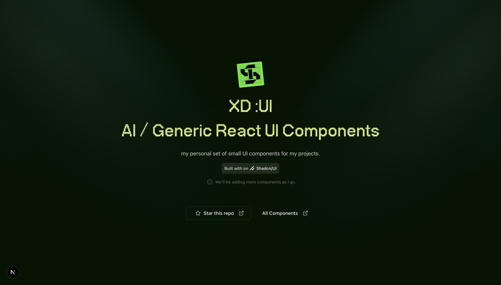

# UI Showcase Landing Page



A modern, minimal UI component showcase built with Next.js 15, TypeScript, and Tailwind CSS. This project demonstrates beautiful, reusable components with interactive examples and clean code presentation.

## ✨ Features

- **50+ UI Components** - Built with Radix UI primitives and styled with Tailwind CSS
- **Interactive Showcase** - Live component previews with code highlighting
- **Modern Stack** - Next.js 15, React 19, TypeScript, Framer Motion
- **Responsive Design** - Mobile-first approach with beautiful animations
- **Developer Experience** - Hot reload, TypeScript support, and clean code structure

## 🚀 Quick Start

```bash
# Clone the repository
git clone https://github.com/suraj-xd/ui-showcase-landing-page.git

# Install dependencies
yarn install
# or
npm install

# Start development server
yarn dev
# or
npm run dev
```

Open [http://localhost:3000](http://localhost:3000) to view the showcase.

## 📁 Project Structure

```
├── app/                    # Next.js App Router
├── components/
│   ├── ui/                # Reusable UI components (50+ components)  
│   ├── custom/            # Custom showcase components
│   ├── examples/          # Interactive examples
│   └── showcase-*.tsx     # Showcase layout components
├── lib/                   # Utilities and configurations
├── styles/                # Global styles and Tailwind config
└── types/                 # TypeScript type definitions
```

## 🎨 Components Included

### Core UI Components
- **Forms**: Input, Textarea, Select, Checkbox, Radio, Switch
- **Navigation**: Breadcrumb, Menu, Tabs, Pagination
- **Feedback**: Alert, Toast, Progress, Skeleton
- **Overlay**: Dialog, Popover, Tooltip, Sheet
- **Data Display**: Card, Table, Avatar, Badge
- **Layout**: Accordion, Collapsible, Separator, Resizable

### Showcase Components
- **Claude Style Chat Input** - AI-powered chat interface
- **Google Drive Toaster** - File upload notifications
- **Status Pills** - Dynamic status indicators
- **AI Agent Avatar** - Animated agent representations
- **Font Showcase** - Typography demonstrations
- **Interactive Examples** - Live component demos

## 🛠️ Built With

- [Next.js 15](https://nextjs.org/) - React framework
- [React 19](https://reactjs.org/) - UI library
- [TypeScript](https://www.typescriptlang.org/) - Type safety
- [Tailwind CSS](https://tailwindcss.com/) - Styling
- [Radix UI](https://www.radix-ui.com/) - Headless components
- [Framer Motion](https://www.framer.com/motion/) - Animations
- [Lucide React](https://lucide.dev/) - Icons

## 🔧 Development

```bash
# Development
yarn dev

# Build for production
yarn build

# Start production server
yarn start

# Lint code
yarn lint
```

## 📝 Note

> **Work in Progress**: Some existing components are still being refined in terms of props, error handling, and animations. Updates coming soon! 

The showcase is functional and demonstrates the component capabilities, but we're continuously improving the developer experience and component APIs.

## 🤝 Contributing

We welcome contributions! Whether it's:
- 🐛 Bug fixes
- ✨ New components
- 📚 Documentation improvements
- 🎨 Design enhancements

### How to Contribute

1. Fork the repository
2. Create a feature branch (`git checkout -b feature/amazing-component`)
3. Commit your changes (`git commit -m 'Add amazing component'`)
4. Push to the branch (`git push origin feature/amazing-component`)
5. Open a Pull Request

## ⭐ Show Your Support

If this project helped you or you found it interesting, please consider:

- ⭐ **Starring this repository**
- 🐛 **Reporting issues**
- 🔀 **Contributing code**
- 📢 **Sharing with others**

---

**Built with ❤️ by [Suraj Gaud](https://github.com/suraj-xd)**

[](https://github.com/suraj-xd)
[](https://twitter.com/notsurajgaud)
